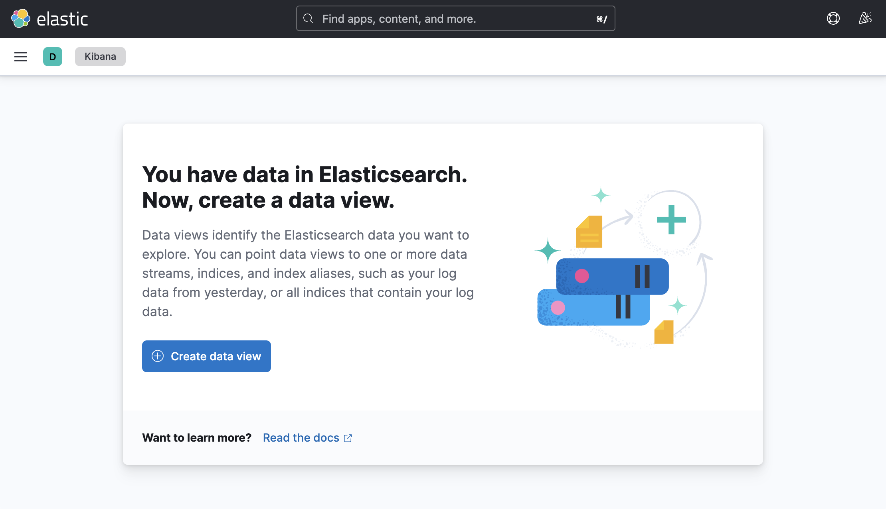
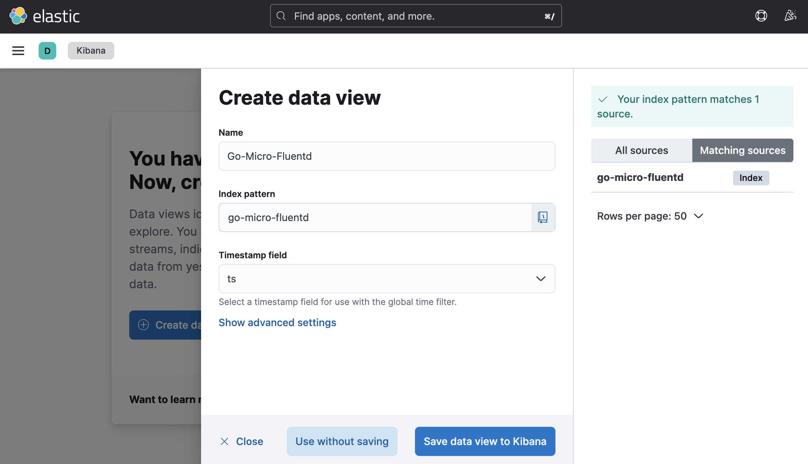
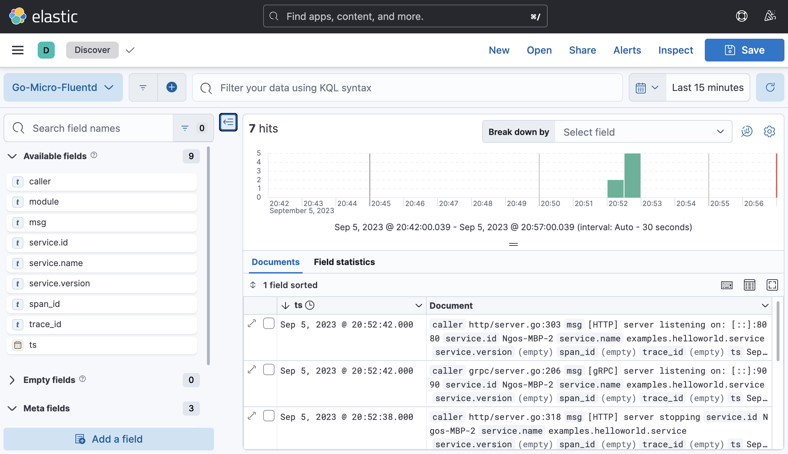
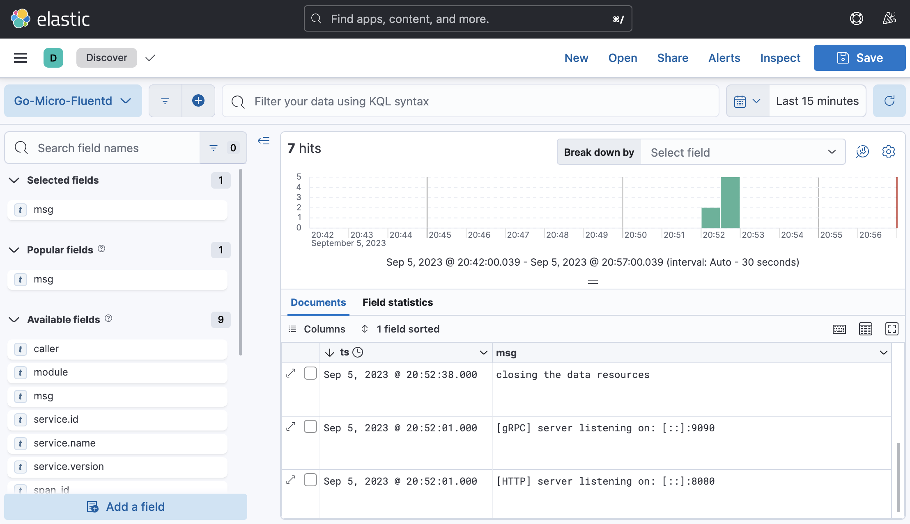

# Go-Micro connects to the EFK log system

## Deploy EFK

Use the following command to create a Docker container and run it in the background:

```bash
docker-compose up -d
```

## Kibana query log

Kibana's access port is 5601, so we can access: [http://127.0.0.1:5601/](http://127.0.0.1:5601/)

When we first entered Kibana, it was blank and nothing. Then, we need to add a `Data View`, which is equivalent to creating a log query view.



We click `Discover` -> `Create a data view`, and then we will see the following interface:



We fill in `go-micro-fluentd` in the `Index pattern` text box.
With the `Timestamp field` we can find `ts` from the drop-down box and select it.
Then, we can click `Save data view to Kibana` to create the view.

We will see a view of the log query:



In this view, what we see is only the most original log information.
We can check `msg` or other fields that need attention on the left, and Kibana will filter out the information we care about:



If you need to build a more complex query, you can build a query statement in the top search bar.